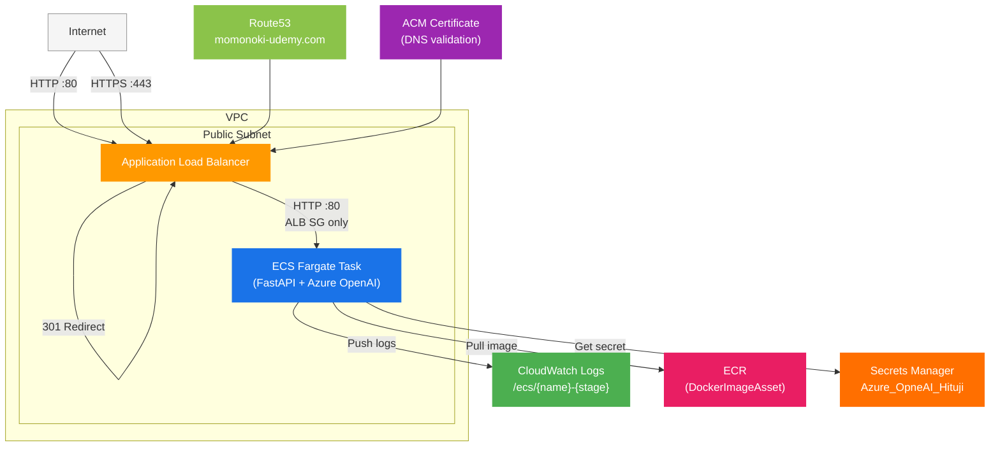

# ecs-webapp-mgr

AWS CDK v2 (TypeScript) を使った ECS Fargate ベースの部門マネージャー AI チャットアプリケーションです。

---

## 用途

- Azure OpenAI を使った AI チャット UI を ECS Fargate でホスティングする構成
- Route53 + ACM による独自ドメイン HTTPS 対応
- Secrets Manager で Azure OpenAI のクレデンシャルを管理
- `dept-skill` サブモジュールでスキル定義・チームデータを管理
- `app-config.json` を編集するだけで、プロジェクト名・ステージ・スペックを切り替え可能

---

## アーキテクチャ



| リソース | 設定 |
|---|---|
| VPC | 2AZ / NAT×0 / パブリックサブネットのみ |
| ALB | インターネット公開 / HTTP:80 → HTTPS:443 リダイレクト |
| ACM | momonoki-udemy.com / Route53 DNS 検証 |
| Route53 | momonoki-udemy.com の A レコード（ALB エイリアス） |
| ECS | Fargate / 256CPU / 512MiB / desiredCount:1 / パブリック IP あり |
| CloudWatch Logs | `/ecs/{name}-{stage}` / 7日保持 |
| ECR | CDK DockerImageAsset で自動プッシュ |
| Secrets Manager | `Azure_OpneAI_Hituji`（Azure OpenAI クレデンシャル） |

---

## フォルダ構成

```
ecs-webapp/
├── app/                         # FastAPI アプリケーション
│   ├── dept-skill/              # スキル定義・チームデータ（git submodule）
│   │   ├── .claude/skills/      # スキル定義（dept-manager / workflows / shared）
│   │   └── team_data/           # チームメンバーデータ
│   ├── Dockerfile
│   ├── main.py                  # FastAPI エントリーポイント
│   ├── requirements.in          # 直接依存パッケージ
│   ├── requirements.txt         # pip-compile で生成
│   └── templates/
│       └── index.html
├── bin/
│   └── ecs-webapp.ts            # CDK App エントリーポイント
├── lib/
│   └── ecs-webapp-stack.ts      # Stack 定義
├── app-config.json              # プロジェクト・スタック設定
├── cdk.json
├── package.json
└── tsconfig.json
```

---

## アプリケーション概要

### API エンドポイント

| メソッド | パス | 内容 |
|---|---|---|
| `GET` | `/` | チャット UI（HTML） |
| `GET` | `/api/skills` | 利用可能なスキル一覧を返す |
| `POST` | `/api/chat` | Azure OpenAI へストリーミングチャット |

### スキル構成

`dept-skill/.claude/skills/` 以下のカテゴリを自動検出：

- `dept-manager/` — 部門マネージャー向けスキル
- `workflows/` — ワークフロースキル
- `shared/` — 全スキル共通のスタイルガイド

### Secrets Manager の構成

Secrets Manager に以下のキーを持つシークレット `Azure_OpneAI_Hituji` を事前に作成してください。

```json
{
  "API_KEY": "<Azure OpenAI API Key>",
  "END_POINT": "<Azure OpenAI Endpoint URL>",
  "DEPLOYMENT_NAME": "<デプロイ名>"
}
```

---

## セットアップからデプロイまで

### 1. 前提条件

```bash
# Node.js (v18 以上)
node --version

# AWS CDK CLI
npm install -g aws-cdk
cdk --version

# AWS CLI
aws --version

# Docker（ECS イメージビルドに必要）
docker --version
```

### 2. AWS 認証設定

```bash
aws configure
# AWS Access Key ID:
# AWS Secret Access Key:
# Default region name: ap-northeast-1
# Default output format: json
```

### 3. サブモジュールの初期化

```bash
git submodule update --init --recursive
```

### 4. 依存パッケージのインストール

```bash
npm install
```

### 5. 設定の確認

`app-config.json` でプロジェクト情報・スタックパラメータを確認・編集します。

```json
{
  "project": {
    "name": "ecs-webapp-mgr",
    "stage": "dev",
    "description": "ECS Fargate Web Application"
  },
  "domain": {
    "name": "momonoki-udemy.com"
  },
  "stack": {
    "vpc": { "maxAzs": 2, "natGateways": 0 },
    "logs": { "retentionDays": 7 },
    "ecs": { "clusterName": "web-app-cluster", "cpu": 256, "memoryLimitMiB": 512, "desiredCount": 1, "containerPort": 80 },
    "alb": { "port": 443 }
  }
}
```

### 6. Secrets Manager の準備

デプロイ前に AWS Secrets Manager で `Azure_OpneAI_Hituji` シークレットを作成してください（「Secrets Manager の構成」参照）。

### 7. Bootstrap（初回のみ）

```bash
cdk bootstrap
```

### 8. ビルド確認

```bash
npm run build
cdk synth
```

### 9. デプロイ

```bash
cdk deploy
```

デプロイ完了後、`https://momonoki-udemy.com` にブラウザでアクセスします。

```
Outputs:
EcsWebappMgrStack.AlbDnsName = xxx.ap-northeast-1.elb.amazonaws.com
```

### 10. 削除

```bash
cdk destroy
```

---

## ローカル動作確認

ローカル実行には Azure OpenAI のクレデンシャルが必要です。`.env.local.example` を参考に環境変数を設定してください。

```bash
cd app
docker build -t ecs-webapp-mgr .
docker run -p 8080:80 ecs-webapp-mgr
# → http://localhost:8080
```

---

## 注意事項

> **本番利用時は Secrets Manager のシークレットを必ず事前に作成してください。**
> ECS タスクはコンテナ起動時に `Azure_OpneAI_Hituji` シークレットを取得します。シークレットが存在しない場合、コンテナが起動できません。

> **Route53 のホストゾーンが事前に存在している必要があります。**
> `domain.name` に指定したドメインのホストゾーンが Route53 に存在しないと、CDK のデプロイ（`fromLookup`）に失敗します。

---

## CDK 主要コマンド

| コマンド | 内容 |
|---|---|
| `npm run build` | TypeScript をコンパイル |
| `npm run watch` | ウォッチモードでコンパイル |
| `cdk synth` | CloudFormation テンプレートを生成 |
| `cdk diff` | デプロイ済みスタックとの差分確認 |
| `cdk deploy` | デプロイ |
| `cdk destroy` | スタック削除 |
